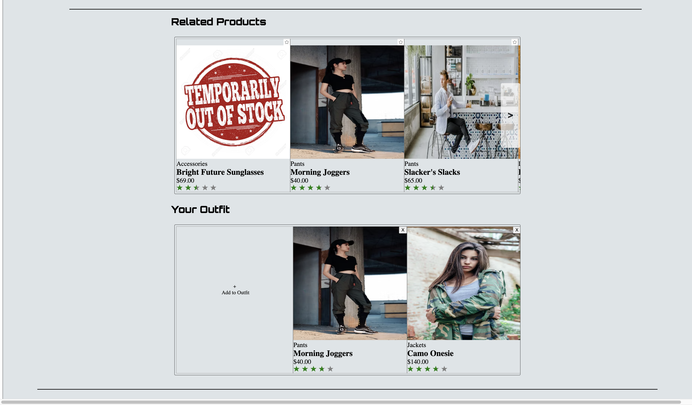
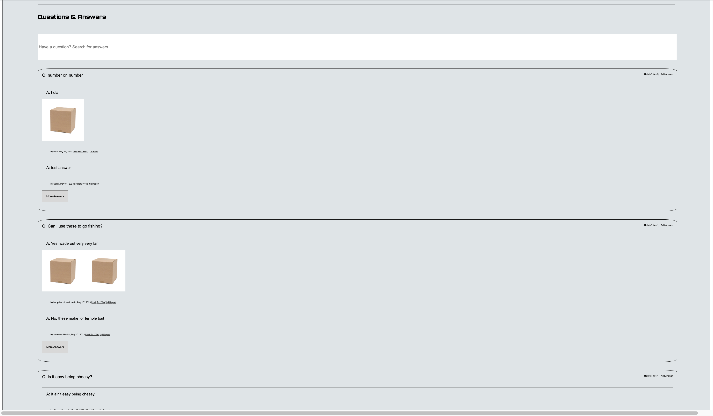
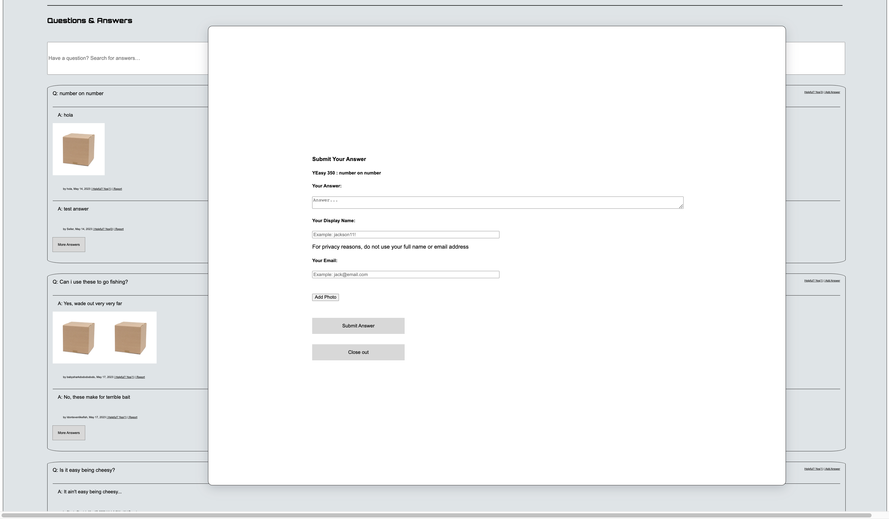
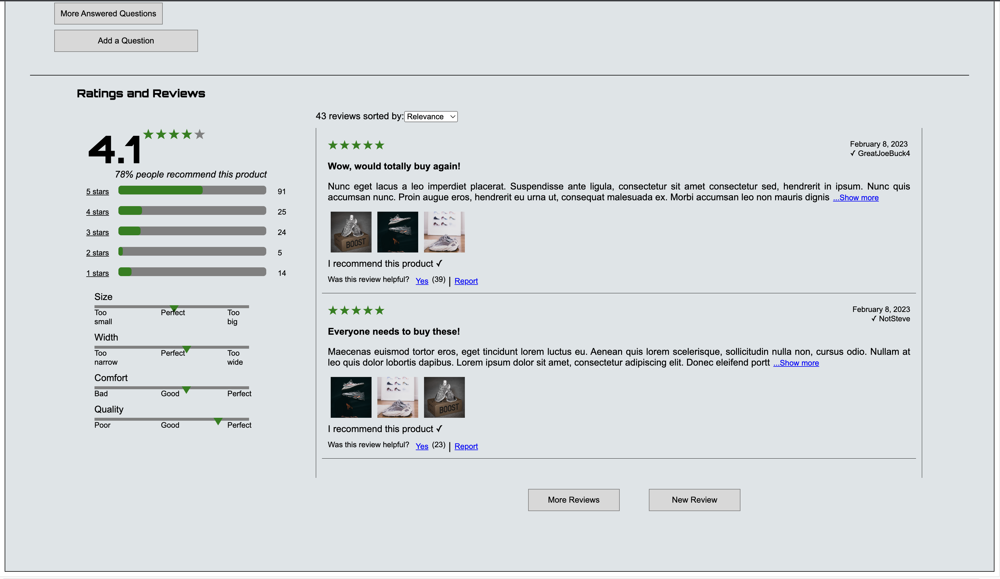
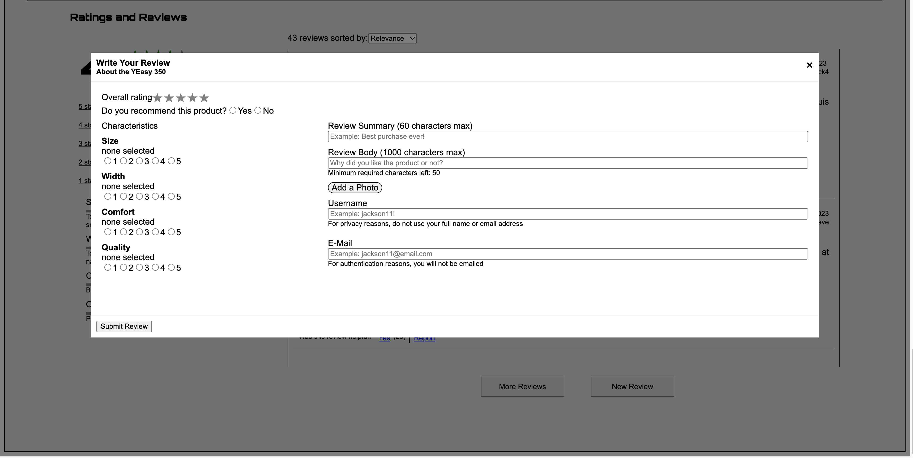

# Front-End Capstone: WALL-E MART


Table of Contents
- [Description](#description)
- [Features](#features)
- [Project Overview & Demos](#project-overview--demos)
   - [Overview](#overview)
   - [Related Items & Comparison](#related-items--comparison)
   - [Questions & Answers](#questions--answers)
   - [Ratings & Reviews](#ratings--reviews)
- [Contributions](#contributions)


## Description
FEC Capstone is a modern storefront front-end application built using the latest web technologies. It aims to provide a seamless and engaging shopping experience for users.

## Features

- **Modern UI**: The application boasts a visually appealing and intuitive user interface, providing a delightful shopping experience.
- **Responsive Design**: The storefront is fully responsive and optimized for various screen sizes, allowing users to browse and purchase products on any device.
- **Product Catalog**: Browse a wide range of products and view detailed information, including prices, descriptions, and customer reviews.
- **Search and Filtering**: Easily search for products and apply filters to refine your search results based on categories, brands, or other attributes.
- **Product Recommendations**: Get personalized product recommendations based on your browsing history and preferences.
- **Rating and Reviews**: Leave ratings and reviews for products, and read feedback from other customers to make informed purchase decisions.
- **Cart and Checkout**: Add products to your cart and seamlessly proceed to the checkout process for a secure and convenient shopping experience.

## Project Overview & Demos

## Overview

The Overview module, positioned at the top of the Product Detail page, encompasses several key sub-components.

The Image gallery showcases a collection of images that provide visual representations of the product, aiding customers in assessing its appearance.

The Product information segment presents essential details and specifications about the product, such as its name, price, description, and any other relevant information to help customers make informed purchasing decisions.

The Style selector enables users to choose different variations or styles of the product, such as color or size options, allowing them to customize their selection.

Lastly, the Add to cart area provides an area to select a size and quantity, along with a button that allows customers to easily add the product to their shopping cart.


## Related Items & Comparison
The Related Items & Comparison module will display two sets of related products. The first set will be a list of products, determined internally, that are related to the product currently being viewed.

The first list for related products will be the same for every customer. It will display products which have been associated with the current product by the company. User interactions will not change the list. The related products list will be the same each time the product is loaded, and will display the same product cards in a carousel like list.

A second list of products will appear below the standard Related Products section. It will contain products which the user has selected to group together as an outfit. This list will have the same format as the related products section, and will display the same product cards in a carousel like list.

Unlike the related products list that appears first, the products which appear in this list will not be determined internally, but will be unique to each user. Items will be added to the list only when a user explicitly selects them to be added.

Also unlike the related products list, the first card that appears on the left hand side of the list should not contain a product. By default, this list should contain no products within it.



## Questions & Answers
The Questions & Answers module encompasses various functionalities, including viewing and searching questions, asking new questions, providing answers, and offering feedback.

The module features a list of up to 4 initial questions, with the option to load more questions as needed. The questions appear in order of helpfulness, determined by user feedback. Each question includes a corresponding list of answers, with the ability to expand and collapse the list.

Answers are sorted by helpfulness, with seller answers prioritized. Users can mark answers as helpful, report answers for review, and view additional answers by clicking on appropriate links.

The module also supports a search bar for filtering questions based on user queries. The component includes modal windows for adding new questions and submitting answers, with validation checks for mandatory fields and the option to upload photos.





## Ratings & Reviews

These sections provide users with the ability to read and submit reviews, sort and filter them, and provide feedback on specific product characteristics, enhancing the overall review functionality within the Ratings & Reviews module.

The rating breakdown displays the average rating for the product as well as the count of total reviews per rating. Clicking on a rating breakdown filters the reviews list accordingly. The product breakdown shows the average feedback received for specific characteristics of the product, such as size, width, comfort, quality, length, and fit.

The reviews list displays submitted reviews on tiles. The list can be expanded with a "More Reviews" button, and sorting options allow users to change the order of the reviews based on their helpfulness, newest submissions, or relevance. The default sort order is relevance, and changing the sorting option refreshes the reviews list.

Users can create new reviews for the selected product by providing an overall rating, recommending the product or not, selecting characteristics, and adding a review summary and body.





## Installation

Follow these steps to set up the FEC Capstone project on your local machine:

1. Clone the repository:

   ```
   git clone https://github.com/FEC-Wall-E/RFE-2303-FEC
   ```

2. Install the project dependencies:

   ```bash
   npm install
   ```

## Usage

To start the development server and launch the application, run the following commands:

```bash
npm run server-dev
```

```bash
npm run client-dev
```

Open your browser and visit [http://localhost:3000](http://localhost:3000) to access the application.

## Testing

The project includes a comprehensive test suite to ensure its stability and reliability. To run the tests, use the following command:

```bash
npm test
```

## Technologies Used

- **Front-end**: React, React DOM, Axios, React Star Ratings
- **Bundling**: Webpack, Babel
- **Styling**: CSS, SASS
- **Server**: Express
- **Testing**: Jest, React Testing Library

## Contributions

This project was created by Daniel Leebron, Koen Arnold, Neeki Askari, and Evan Pun in collaboration with Hack Reactor.


